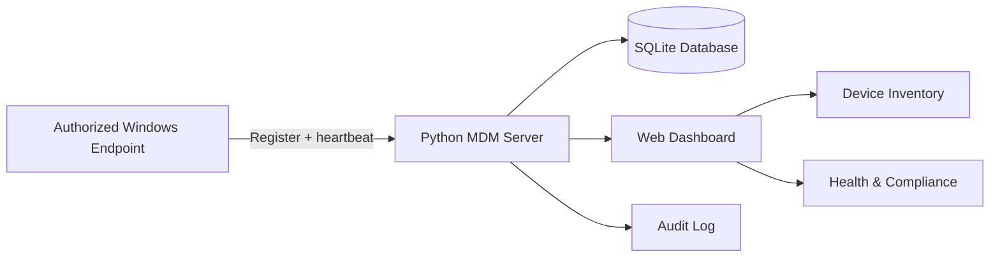
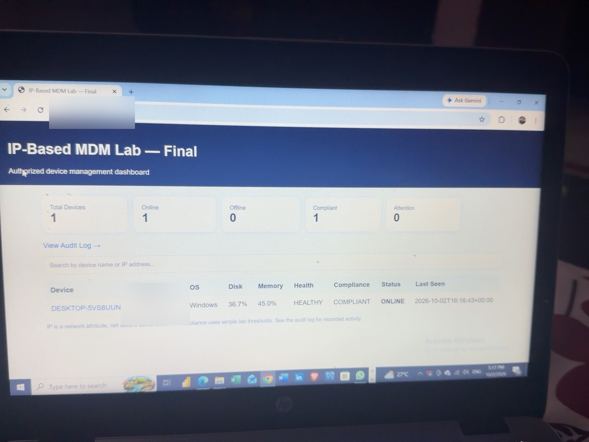

# IP-Based MDM Lab — Final One-File Project

A beginner-friendly **Mobile/Device Management (MDM) lab** built with Python's standard library.

This project demonstrates how a management server can register an authorized endpoint, receive periodic device heartbeats, collect basic system telemetry, evaluate simple health/compliance rules, and record device activity in an audit log.

> **Lab scope:** This project is intended for devices you own or are explicitly authorized to manage. It is a local portfolio/learning project, not a production MDM platform.

## Project Highlights

- Python standard library only — no third-party packages required
- Single-file implementation
- Local HTTP management server
- Automatic device registration
- IP-address and hostname tracking
- Periodic heartbeat/check-in every 15 seconds
- Basic endpoint inventory:
  - Hostname
  - IP address
  - Operating system and version
  - CPU
  - RAM
  - Disk usage
  - Memory usage
  - Battery level when available
  - Uptime
  - Last-seen timestamp
- Health assessment
- Simple compliance assessment
- Online/offline status
- Search by device name or IP address
- SQLite persistence
- Device details view
- Audit log
- Dashboard metrics

## Architecture



### Data flow

1. The endpoint agent collects basic local system information.
2. The agent sends registration/check-in data to the MDM server.
3. The server stores the device inventory in SQLite.
4. The server evaluates simple health and compliance thresholds.
5. The dashboard displays the current device state.
6. Check-ins are written to the audit log.

## Repository Structure

```text
MDM_IP_Lab/
├── mdm_ip_one_file_final.py
├── README.md
└── docs/
    └── screenshots/
        ├── dashboard.png
        └── audit-log.png
```

## Requirements

- Windows, Linux, or another Python-supported system
- Python 3
- A device you own or are authorized to manage
- No external Python packages are required

## How to Run

### 1. Start the server

Open a terminal in the project folder:

```powershell
python mdm_ip_one_file_final.py server
```

The server provides the local dashboard at:

```text
http://localhost:5000
```

### 2. Start the agent

Open a second terminal in the same folder:

```powershell
python mdm_ip_one_file_final.py agent --server http://localhost:5000
```

The agent registers the endpoint and sends a heartbeat every 15 seconds.

### 3. Open the dashboard

Visit:

```text
http://localhost:5000
```

The audit log is available at:

```text
http://localhost:5000/audit
```

## Dashboard

The final dashboard reports:

| Metric | Purpose |
|---|---|
| Total Devices | Number of registered devices |
| Online | Devices that have checked in recently |
| Offline | Devices that have not checked in recently |
| Compliant | Devices meeting the lab's simple compliance rules |
| Attention | Devices requiring attention based on the lab rules |

The device table also shows IP, OS, disk usage, memory usage, health, compliance, online status, and last-seen time.

## Health & Compliance Logic

The project uses intentionally simple lab thresholds.

A device can be marked for attention when resource usage becomes high or battery level becomes low.

The current lab rules include:

- Disk usage ≥ 90% → compliance issue
- Memory usage ≥ 90% → compliance issue
- Battery ≤ 15% → compliance issue

These thresholds are educational examples and should not be treated as enterprise policy.

## Audit Logging

The audit log records device activity such as:

- Device check-in
- Heartbeat/enrollment events
- Device IP address
- Device identifier
- Timestamp

This demonstrates a basic security operations concept: maintaining an activity trail for endpoint events.

## Screenshots

### Dashboard



The verified lab dashboard shows one registered device online, with health and compliance information.

### Audit Log


The audit page shows timestamped device check-ins and heartbeat/enrollment activity.

## Security Design Notes

This lab deliberately uses an **IP-based identification model** because the goal was to demonstrate network-aware device management in a beginner-friendly environment.

An IP address is a **network attribute, not a secure device identity**.

For a production MDM system, stronger controls would be required, including:

- TLS/HTTPS
- Strong device authentication
- Device certificates or another cryptographic identity mechanism
- Role-based access control (RBAC)
- Secure secret storage
- Signed/validated management commands
- Authorization checks
- Rate limiting
- Input validation
- Centralized logging and monitoring
- Platform-specific management APIs
- Secure database configuration
- Key rotation and revocation

This project intentionally does not implement those production controls.

## Cybersecurity Concepts Demonstrated

This project can be discussed as a cybersecurity portfolio project because it demonstrates:

- Endpoint management
- Asset inventory
- Network addressing
- Client/server communication
- HTTP APIs
- System telemetry
- Heartbeat monitoring
- Availability monitoring
- Compliance checks
- Audit logging
- SQLite data persistence
- Basic security design trade-offs
- Security limitations and threat awareness

## What I Learned

Building this project helped demonstrate the practical relationship between:

**Endpoint → Network → Server → Database → Monitoring → Compliance → Audit**

It also reinforced an important security principle:

> Convenience-based identifiers such as IP addresses should not be confused with strong authentication.

## Future Production Improvements

If this lab were extended toward an enterprise design, the next architectural improvements would include:

1. HTTPS/TLS for all communications
2. Cryptographically authenticated devices
3. RBAC for administrators
4. Signed management commands
5. Secure command authorization
6. Persistent centralized logging
7. Alerting and incident-response integration
8. Device enrollment lifecycle management
9. Database hardening and backups
10. Platform-specific controls for Windows, Android, iOS/macOS, and Linux

## Portfolio Description

### Short CV Version

**IP-Based Mobile Device Management (MDM) Lab — Python**  
Built a one-file endpoint management lab that registers authorized devices, collects system telemetry, monitors heartbeat status, evaluates basic health/compliance rules, persists device data in SQLite, and maintains an audit log through a local web dashboard.

### LinkedIn Version

I built a lightweight **IP-Based MDM Lab in Python** to strengthen my practical cybersecurity and endpoint-management skills.

The project demonstrates device registration, IP-based inventory, heartbeat monitoring, system telemetry, health/compliance checks, SQLite persistence, dashboard monitoring, and audit logging.

One of my key takeaways was understanding that an IP address can help identify a device's network location, but **it should not be treated as secure authentication**.

This project strengthened my understanding of endpoint visibility, monitoring, compliance, logging, and secure system design.

#Cybersecurity #Python #EndpointSecurity #MDM #InformationSecurity #SecurityOperations #CybersecurityProjects #GitHub

## Interview Talking Points

If asked to explain the project in an interview:

**What did you build?**  
I built a lightweight MDM lab in Python that allows an authorized endpoint to register with a management server and periodically send system telemetry.

**How does it work?**  
The endpoint agent collects information such as hostname, IP address, OS, disk and memory usage, battery level, and uptime. It sends that information to the server, which stores it in SQLite and presents it through a web dashboard.

**How did you monitor availability?**  
The agent sends a heartbeat every 15 seconds. The server uses recent check-ins to determine whether the device is online or offline.

**How did you handle compliance?**  
I implemented simple threshold-based rules for disk usage, memory usage, and battery level to demonstrate basic endpoint compliance monitoring.

**What is the security limitation?**  
The biggest limitation is that IP addresses are not strong device identities. In a production environment I would use TLS and cryptographic device authentication, along with RBAC, secure secrets, and signed management operations.

## Ethical / Authorized Use

Use this project only on systems you own or have explicit permission to manage.

Do not use it to secretly monitor, control, or collect information from another person's device.
